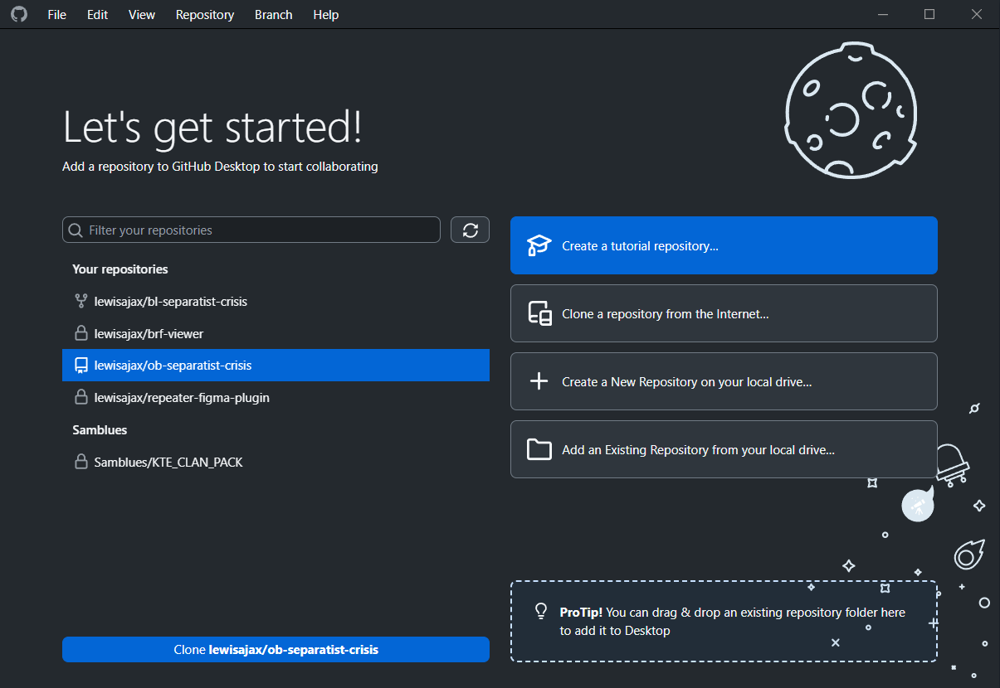
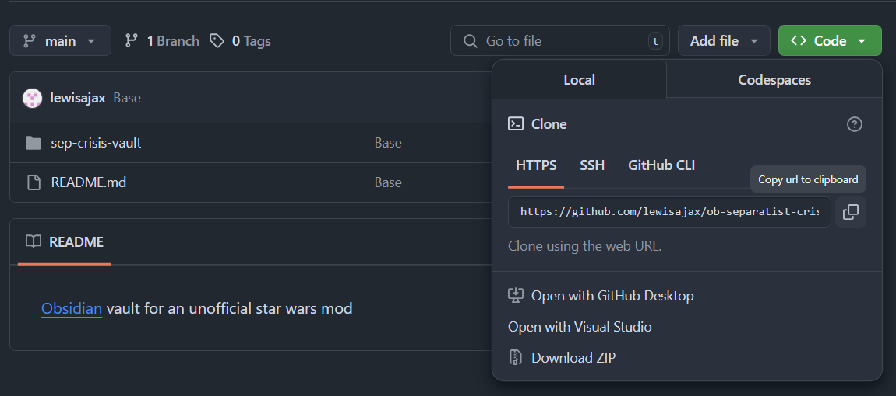
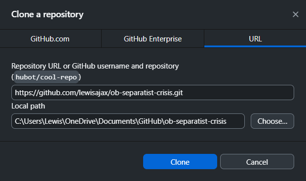
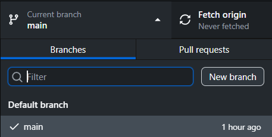
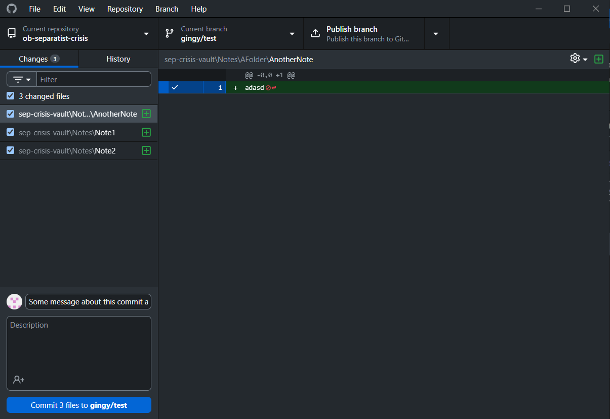

If you haven't already got git, go ahead and download it [https://git-scm.com/](https://git-scm.com/)

For ease of use, we'll go with a git gui client [https://github.com/apps/desktop](https://github.com/apps/desktop) 

You'll also need [https://obsidian.md/](https://obsidian.md/)

When you open the Github Desktop app, if you're already a collaborator you should see this repository on the left and can click the clone button at the bottom.

If you haven't been added as a collaborator yet.

Copy the URL from the github page under 'Code'

Then in Github Desktop, click on 'Clone a repository from the internet' and paste the link you got.

Once you've cloned the repo, you'll want to make a new branch so that the changes you make don't inerfere with other people's changes until you want it to. Give the branch a name like "yourusername/somesubject" or anything really.

You can publish the new branch straight away or after you've done a few commits on it, it's up to you.

The cloned repo's folder path might be in your documents. You can right click the repo box at the top left of the github app and 'Show in explorer' to get the vault's location.

And that should be you good to go. Once you've added a few notes in Obsidian, go back to the github desktop app and there you can commit your changes. Add a short summary of what you've done in the commit message.

When you're happy with the changes you've made, you can merge them into the main branch. 

To merge your branch into main, switch to the main branch and then go to 'Branch' -> 'Merge into current branch' and choose the branch you want to merge.

If you see a warning like this, you will need another program to sort it out.\
[VSCode](https://code.visualstudio.com/) is ideal for dealing with merge conflicts

If you see that the main branch has new changes and you want to add them to your branch. Go to 'Branch' -> 'Update from main'.

If you want to learn a bit more about git and how to use the github desktop app, have a look through this [https://docs.github.com/en/desktop](https://docs.github.com/en/desktop)